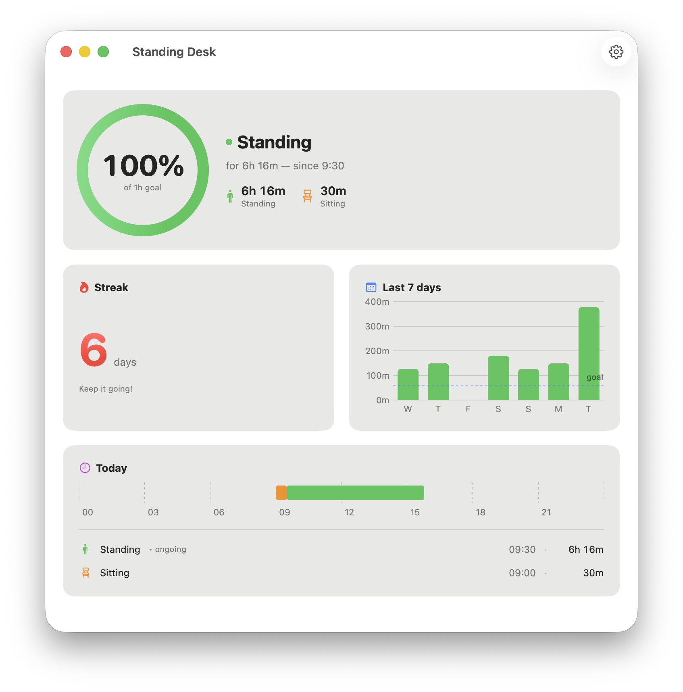

# picostand

A tiny under-desk USB sensor + a macOS menu-bar app that tracks how much
time you actually spend standing at your standing desk, nags you when you
don't, and turns it into streaks so you keep going.

The hardware (a **Pi Pico** + ultrasonic distance sensor) lives under the
desk, powered by a USB cable to your monitor. When the monitor is on, the
laptop is connected, and the app is running, your activity is logged.
Sit and stand transitions are detected from the distance to the floor.



```bash
git clone https://github.com/ast3150/picostand.git
cd picostand
```

## Why

Standing desks are great. People (me) still don't use them. This solves it
with the smallest hardware loop I could think of: ~15 € of parts, no
WiFi, no cloud, no batteries. Just a sensor that knows when you're sitting
or standing, talking to a small Mac app over USB.

## How it works

```
[ floor ]   ←~~~~~~  ultrasonic ping
   ↑
   |  distance  (633 mm sitting, 937 mm standing on my desk)
   ↓
[ RCWL-9620 ] ── I²C ── [ Pi Pico WH ] ── USB ── [ Mac app ]
                                                       │
                                                       └─ SwiftData
                                                       └─ Notifications
                                                       └─ Menu bar UI
```

The Pico samples the distance twice a second, applies hysteresis +
debounce, and only emits a transition event when it sees three samples
in a row clearly in the other zone. The Mac app receives those events as
newline-delimited JSON and writes them to a SwiftData store as
sit/stand sessions. Stats, streaks, charts, and reminders all derive
from that one table.

The Pico has no persistent storage and no clock. The Mac is the source
of truth for time; the Pico just knows "you're sitting" or "you're
standing". This is on purpose — keeps the firmware tiny (~150 lines) and
makes the protocol robust to disconnects.

## Hardware

| Part | What it does | Approx. price |
|------|---|---|
| **Raspberry Pi Pico WH** | The MCU. WH = with pre-soldered headers, so no soldering required. (Plain Pico W also works.) | ~10 € |
| **RCWL-9620 ultrasonic distance sensor (I²C)** | Measures distance to the floor. ~2-450 cm range, ±1 cm. | ~3 € |
| **4 × female-to-female Dupont jumper wires** | Sensor to Pico. Usually come with the sensor. | ~1 € |
| **USB-A → micro-USB cable** | Pico to monitor's USB output. Must be a data cable, not charge-only. | already had one |
| **Double-sided tape or VHB strips** | Stick the Pico + sensor under the desk. | already had some |
| _Optional_: small breadboard | Cleaner prototype, easier to undo. | ~3 € |
| _Optional_: 3D-printed case | Protects the electronics. Search Printables for "RCWL-9620 case" + "Pi Pico case". | filament |

### Wiring

Connect by label, not pin number — different Pico variants print the
labels in different orientations.

| Sensor pin | Pico label | Notes |
|------------|------------|-------|
| VCC | **3V3** (the regulated 3.3 V output — NOT VBUS) | Powers the sensor at 3.3 V so its I²C lines are also 3.3 V, which is safe for the Pico's GPIO. |
| GND | **GND** | Any GND pin will do. |
| SDA | **GP0** | I²C0 data. |
| SCL | **GP1** | I²C0 clock. |

Long wires (>30 cm) over USB-powered devices get noisy — keep it short.

## Firmware (Pi Pico)

The Pico runs **MicroPython**. Flash it once, copy `main.py`, done.

### Flash MicroPython

1. Download the `RPI_PICO_W` UF2 from
   <https://micropython.org/download/RPI_PICO_W/>.
2. Hold the BOOTSEL button on the Pico while plugging in USB. A drive
   named `RPI-RP2` mounts on your Mac.
3. Drag the UF2 onto that drive. The Pico reboots and now shows up as
   a serial device at `/dev/tty.usbmodem*`.

### Install firmware

```bash
brew install mpremote   # or: pipx install mpremote
mpremote connect /dev/tty.usbmodem* cp firmware/main.py :main.py
mpremote connect /dev/tty.usbmodem* reset
```

That's it. The Pico now boots `main.py` on every power-up and starts
streaming events.

### Sanity check

```bash
# Watch live events for 15 s
pipx run --spec pyserial python firmware/listen.py /dev/tty.usbmodem* 15
```

You should see something like:

```json
{"t":"hello","fw":"0.1","sit":633,"stand":937}
{"t":"hb","state":"sitting","d":633,"seq":0}
{"t":"tx","state":"standing","d":903,"seq":1}
{"t":"hb","state":"standing","d":937,"seq":1}
```

### Wire protocol

Newline-delimited JSON, both directions, over USB CDC.

**Pico → Mac**

| `t` | Meaning |
|-----|---------|
| `hello` | Boot announcement with current thresholds. |
| `hb` | Heartbeat every ~10 s with current state + last distance. |
| `tx` | State transition (sit → stand or vice versa). Includes monotonic `seq`. |
| `raw` | Raw distance reading, only emitted in calibration mode. |
| `cfg_ok` | Acknowledgement that thresholds were applied. |
| `cal_ok` | Acknowledgement that calibration mode toggled. |

**Mac → Pico**

| `cmd` | Effect |
|-------|--------|
| `cfg` | Set sit/stand thresholds in mm. Not persisted on Pico — Mac re-sends on connect. |
| `cal` | Toggle raw-distance mode (used during calibration UI). |
| `ack` | Drop events ≤ `seq` from Pico's in-RAM replay buffer. |
| `replay` | Re-emit any buffered transitions. Sent automatically by the app on connect. |

The buffer holds the last 50 transitions in RAM only. Since the Pico is
powered from a monitor USB port, "Pico powered" implies "monitor on"
implies "you're at the desk", so we don't need flash storage.

## macOS app

Requires **macOS 26** (Tahoe), Xcode 17+, and
[Tuist](https://tuist.dev) for project generation.

```bash
brew install --cask tuist     # or: brew install tuist
cd app
tuist install                 # resolve ORSSerialPort dep
tuist generate                # generate StandingDesk.xcworkspace
open StandingDesk.xcworkspace
```

Or build + run from the command line:

```bash
cd app
tuist generate --no-open
xcodebuild -workspace StandingDesk.xcworkspace \
           -scheme StandingDesk \
           -destination "platform=macOS" \
           -derivedDataPath .build build
open .build/Build/Products/Debug/StandingDesk.app
```

### What it does

- **Menu bar** — live state (sitting / standing / blocked), today's
  standing %, streak count, quick links to the main window and settings.
- **Main window** — daily hero with progress ring, streak counter, last
  7 days bar chart vs. goal line, today's timeline.
- **Settings**
  - General: daily standing goal (default 2 h).
  - Notifications: enable + minutes-of-sitting before a reminder
    fires (default 45 min).
  - Desk: connection status, current sensor reading, sit/stand
    thresholds, **Calibrate…** sheet, and maintenance buttons (Reset
    last hour / Reset today / Reset all data).
- **Calibration** — toggles the Pico into raw mode, shows live cm,
  capture sit and stand independently. Rejects out-of-range readings
  (sensor blocked / misaimed).
- **Reminders** — when you've been sitting longer than your threshold,
  fires a Notification Center reminder. Suppressed while disconnected or
  while the sensor is blocked.
- **Streaks** — a day counts toward your streak only if your total time
  at the desk was at least as long as your daily goal. Weekends, sick
  days, and disconnect days are skipped without breaking the streak.
- **Sensor blocked handling** — if the sensor returns readings outside
  300-1500 mm (something in the way, misaligned, garbage), the app
  closes the open session at the last valid reading and pauses time
  accumulation. A new session opens automatically when the sensor
  recovers.

### Architecture

The app code lives in `app/StandingDesk/Sources/`:

| File | Responsibility |
|------|----------------|
| `App.swift` | App entry point, scene composition (`MenuBarExtra`, `Window`, `Settings`), object wiring. |
| `Models/Session.swift` | The single SwiftData `@Model` — `(startedAt, endedAt?, state)`. |
| `Serial/Event.swift` | `PicoEvent` enum + `Codable` decoder for the JSON line protocol. |
| `Serial/SerialReader.swift` | Auto-connects to `/dev/tty.usbmodem*`, parses lines, surfaces `sensorBlocked`, emits change callbacks. |
| `Store/SessionStore.swift` | Applies events to SwiftData, computes totals / streak / weekly stats. |
| `Store/AppSettings.swift` | `@AppStorage`-backed observable settings. |
| `Store/NotificationScheduler.swift` | Per-minute tick that fires the sit-too-long reminder. |
| `UI/MenuBarView.swift` | The menu bar popover. |
| `UI/MainWindow.swift` | The main stats window. |
| `UI/SettingsView.swift` | Settings tabs (General / Notifications / Desk). |
| `UI/CalibrationView.swift` | The calibration sheet. |
| `UI/Format.swift` | Distance / duration formatters + `DeskState` icon / label / tint. |

The Pico firmware is `firmware/main.py`. `firmware/listen.py` is a host
debugging tool only.

## Calibrating to your desk

The bundled `main.py` is calibrated to my desk (633 mm sit, 937 mm
stand). Yours will differ. Two ways to recalibrate:

1. **In the app**: Settings → Desk → Calibrate…. Lower the desk, press
   Capture for sitting, raise it, press Capture for standing, Apply.
   The new thresholds are persisted on the Mac and pushed to the Pico
   on every connect.
2. **Edit `main.py`**: change `SIT_MM` and `STAND_MM` at the top, copy
   to the Pico via `mpremote cp`, reset.

## Known limitations

- One Mac, one desk. The app talks to whichever Pico shows up as
  `tty.usbmodem*` first.
- No persistent storage on the Pico — if it loses power mid-session,
  the in-RAM replay buffer is gone. The Mac is the system of record.
- The Pico cable taking power only when the monitor is on is the
  intended "presence" detector. If you sometimes power the Pico
  separately, the activity log will include time you weren't actually
  at the desk.
- macOS 26 minimum, because the app uses APIs that ship with it. Older
  macOS versions would need code adjustments.

## Repository layout

```
firmware/
  main.py             # MicroPython firmware for the Pico
  listen.py           # Host-side serial reader for bench testing

app/
  Project.swift       # Tuist project definition
  Tuist.swift
  Tuist/Package.swift # External SPM dependencies (ORSSerialPort)
  StandingDesk/
    Sources/          # Swift source (see Architecture above)
    Resources/        # Assets
```

## License

MIT.
